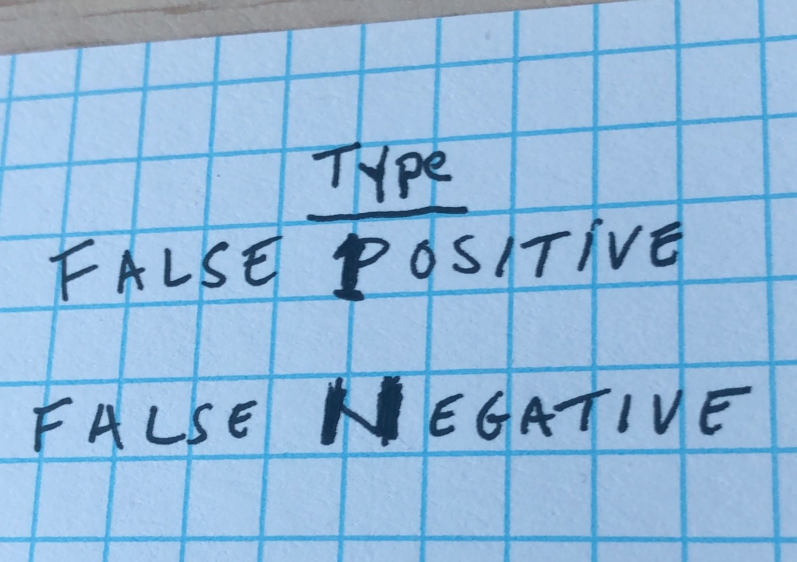

# Calculating the Probability of Type II Error
See this excerpt from Kirk (2013) on Type I and Type II error.

    When the null hypothesis is tested, a researcher's decision will be either correct or incorrect. An incorrect decision can be made in two ways. The researcher can reject the null hypothesis when it is true; this is called Type I error. Alternatively, the researcher can fail to reject the null hypothesis when it is false; this is called Type II error. Likewise, a correct decision can be made in two ways. If the null hypothesis is true and the researcher does not reject it, a correct acceptance has been made; if the null hypothesis is false and the researcher rejects it, a correct decision has been made.

In case it is ever useful, someone once posted this visual on social media as a way to distinguish between Type I and Type II error.

More precisely, the researcher's decision criteria is represented in the table below.
|                           | True situation       |                                           |                                      |
| ------------------------- | -------------------- | ----------------------------------------- | ------------------------------------ |
|                           |                      | $H_0$ True                                | $H_0$ False                          |
| **Researcher’s decision** | Fail to reject $H_0$ | Correct acceptance: Probability = 1 – $α$ | Type II error: Probability = $\beta$ |
|                           | Reject $H_0$         | Type I error: Probability = $α$           | Correct rejection: $1 - \beta$       |

## Applying Type I and Type II decision rules
### Case study: Testing average daily temperature
A scientist wants to test whether the average daily spring temperature has increased from an average of $50$ degrees in a prior year. From past information she knows that the population standard deviation $\sigma$ is $6$ degrees, and she plans to test with $α = 0.05$ using a sample of size $n = 64$ days. Suppose she fails to reject the null hypothesis when it is true (true mean $\mu = 52$), what is the probability of Type II error?

**Steps**:
1. Define the null hypothesis to be tested.

$$
H_0: \mu \le 50.
$$

$$
H_1: \mu > 50.
$$

2. Compute the critical sample mean, $\bar{x}_\alpha$. The critical sample mean, $\bar{x}_\alpha$ is the sample mean that marks the boundary of the rejection region. For an illustration, see below.

$$
\bar{x} = \mu_{H_0} \plusmn (z_\alpha) {\left (\sigma \over \sqrt{n} \right)}
$$

$$
\bar{x} = 50 + (1.645) \left(6 \over \sqrt{64} \right) = 51.23
$$

3. Find the $z$ value for $51.23$, assuming $\mu = 52$. 

$$
z = {51.23 - 52 \over 6} = -1.03
$$

4. Compute the $p$ value for the $z$ score. Recall that $\beta$ is Type II error.

$$
\beta = P(z \le -1.03) = 0.1515
$$
**Result**: The probability of Type II error for this study is $0.1515$ or $15.15\%$.

## Calculating statistical power
From the table above, we can see that the probability of making a correct rejection (right lower quadrant) is power; sometimes referred to as statistical power $(1 - \beta)$.

Therefore, if from the case study above, $\beta = 0.1515$, then power $(1 - \beta) = 1 - 0.1515 = 0.8485$ or $84.85\%$

## References
1. [Roger E. Kirk (2013). Experimental Design: Procedures for the Behavioral Sciences, 4th Edition, SAGE Publications, Inc.](https://methods.sagepub.com/book/experimental-design)

2. Robert A. Donnelly (2020). Business Statistics (2020)