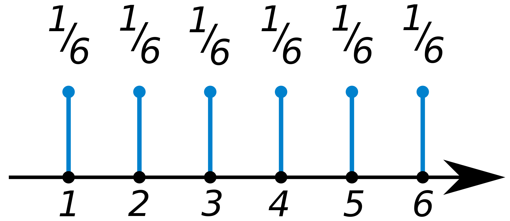

# Probability Distribution Functions (PDFs)
Fundamentally, the difference between Probability Distribution Functions (PDFs) is knowing which of these distributions apply to discrete variables and which one applies to continuous variables. 

Both the PMF and the PDF can be used to construct respective *Cummulative Distribution Functions* (CDF).

## Probability Mass Function (PMF)
This applies to discrete variables (e.g., a fair coin or die). Therefore, all values of a PMF are non-negative and must sum up to $1$. In the case of a fair die, assuming we plot the PMF, we get a uniform distribution where the corresponding value on the $y$ axis will be $0.167$. There are three major distributions associated with PMF: Benoulli, Binomial, and geometric distribution.

The corresponding $x$ axis will range from $1$ to $6$, representing each side of the fair die. If we plot its CDF, we'll get an s-curve or sigmoidal distribution with a $y$ axis that ranges from $0$ to $1$. The points $(4, 0.6)$ on the CDF, represent the probability of rolling a $4$ or less. That is, it is equivalent to:

$$
P(X \le 4) = P(X = 1) + P(X = 2) + P(X = 3) + P(X = 4) = 0.67
$$

## Probability Density Function (PDF)
This applies to continuous variables or better said, A PDF is a continuous distribution. The $y$ axis of the PDF is on a scale of $0$ to $1$, representing probability values. How should we interprete probability values of the PDF? 

## Cummulative Density Function (CDF)
Similar to the PMF, the $y$ axis of the CDF ranges from $0$ to $1$. The CDF curve is an $S$ or sigmoidal curve if it is from a PDF that is a normal distribution. That is, a normal distribution in its PDF will be s-shaped in its CDF. 

Note, the final point of a CDF will be equivalent to $1$. Also, one-half of the PDF is equivalent to accumulating $50\%$ or half of the CDF.

In the CDF, can we guage how much of the distribution will be around the mean? We can guage by calculating the gradient around the mean. The higher the gradient of the greater the density/distribution that must be hovering around the mean value. Essentially, the gradient of the CDF is the PDF.

Formally, the differential of the CDF is equal to the PDF.

$$
{dF(x) \over dx} = f(x)
$$

Alternatively, the integral of the PDF from negative infinity $-∞$ to $x$ is equal to the CDF.

$$
\int_{-∞}^xf(x)dx = F(x)
$$

## References
1. [Probability mass function](https://en.wikipedia.org/wiki/Probability_mass_function) 
2. [Zed Statistics: Probability Distribution Functions (PMF, PDF, CDF)](https://www.youtube.com/watch?v=YXLVjCKVP7U)